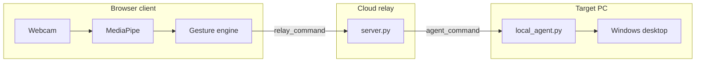

# Desktop AI Controller

Control your Windows PC with **hand gestures** and **voice commands**—no physical mouse required for many tasks. The system uses **MediaPipe** for real-time hand tracking and relays lightweight commands through a **cloud WebSocket server** to a **local agent** that executes actions on your desktop.


---

## Table of Contents

- [Overview](#overview)
- [Features](#features)
- [Architecture](#architecture)
- [How It Works](#how-it-works)
- [Project Structure](#project-structure)
- [Requirements](#requirements)
- [Quick Start (Cloud)](#quick-start-cloud)
- [Local Development](#local-development)
- [Deployment](#deployment)
- [Interaction Modes & Gestures](#interaction-modes--gestures)
- [Voice Commands (Jarvis)](#voice-commands-jarvis)
- [Legacy Local App](#legacy-local-app)
- [Configuration](#configuration)
- [Troubleshooting](#troubleshooting)
- [Performance](#performance)
- [License](#license)
- [Acknowledgments](#acknowledgments)

---

## Overview

**Desktop AI Controller** is a computer-vision-based desktop automation system. You use a webcam (on a phone or PC) to gesture in the air; the browser detects your hand and sends small command messages to a server; a Python agent on the **target PC** moves the cursor, clicks, changes slides, or runs voice-triggered actions.

### Why cloud + local agent?

| Design choice                      | Benefit                                                    |
| ---------------------------------- | ---------------------------------------------------------- |
| **Hand tracking in the browser**   | Video stays on your device—lower latency, more privacy     |
| **Commands only over the network** | Tiny payloads (`MOUSE_MOVE`, clicks)—not full video upload |
| **Room-based pairing**             | Same 6-character room ID links any browser to your PC      |
| **Local agent on target PC**       | Only the machine running `local_agent.py` is controlled    |

### Two ways to run the project

| Mode                    | Entry point               | Best for                                       |
| ----------------------- | ------------------------- | ---------------------------------------------- |
| **Cloud (recommended)** | Web UI + `local_agent.py` | Control from any device; production deployment |
| **Legacy local**        | `python mainGUI.py`       | All-in-one PyQt app on one Windows PC          |

---

## Features

- **Mouse mode** — Move cursor, left/right click, drag and drop
- **Presentation mode** — Previous/next slide via finger holds and palm/fist gestures
- **Media mode** — Play/pause, next/previous track via swipes and full palm
- **Jarvis mode** — Voice commands (browser speech-to-text → agent actions)
- **Smooth cursor** — Median filter and dead-zone smoothing in the browser
- **Mini / pop-out windows** — Keep tracking when the main tab is minimized
- **Background session** — Wake lock and hidden-tab frame loop for continuous control
- **Optional server-side CV** — Fallback path if client-side tracking is disabled

---

## Architecture

### High-level flow

```
┌─────────────┐     WebSocket      ┌──────────────┐     WebSocket      ┌─────────────────┐
│   Browser   │  relay_command     │ Cloud server │  agent_command     │  local_agent.py │
│  (React +   │ ─────────────────► │  server.py   │ ─────────────────► │   (PyAutoGUI)   │
│  MediaPipe) │                    │ Flask-SocketIO│                    │  Target Windows │
└─────────────┘                    └──────────────┘                    └─────────────────┘
       │                                    │
       └── Webcam stays local               └── Rooms pair frontend + agent
```

### Six processing layers

| Layer                 | Component                              | Role                                     |
| --------------------- | -------------------------------------- | ---------------------------------------- |
| 1. Input              | Webcam + microphone (browser)          | Capture video/audio on the client device |
| 2. Gesture processing | MediaPipe WASM + `gestureEngine.ts`    | 21 landmarks → classified actions        |
| 3. Voice              | Web Speech API + `voice_command` relay | Speech → text → agent                    |
| 4. Routing            | Mode manager + Socket.IO rooms         | Mouse / Presentation / Media / Jarvis    |
| 5. Execution          | `local_agent.py`                       | OS-level mouse, keyboard, apps           |
| 6. Feedback           | React canvas UI                        | Landmarks, mode, FPS, connection status  |

### Mermaid diagram



---

## How It Works

1. Open the **web frontend** and enter the **server URL** and **room ID**.
2. Click **Connect** — the browser joins the room as `frontend` with **client-side tracking** enabled.
3. On the PC you want to control, run **`local_agent.py`** with the same server URL and room ID (joins as `agent`).
4. Click **Start Camera Stream** — MediaPipe runs in the browser at ~30 FPS.
5. Each frame: landmarks → `processGestures()` → `relay_command` → server → `agent_command` → PyAutoGUI / Win32 cursor.
6. After ~4 seconds without hand commands, the agent **releases** the cursor so your normal mouse works again.

---

## Project Structure

```
Desktop_AI_Controller/
├── frontend/                 # React + Vite web app
│   └── src/
│       ├── App.tsx           # Main UI, Socket.IO, camera loop
│       ├── handTracker.ts    # MediaPipe WASM loader + canvas draw
│       ├── gestureEngine.ts  # Finger rules, modes, screen mapping
│       ├── smoothPointer.ts  # Cursor stabilization
│       ├── backgroundSession.ts
│       ├── CompanionApp.tsx  # Mini pop-out window
│       └── companionWindow.ts
├── server.py                 # Flask-SocketIO cloud relay
├── local_agent.py            # Desktop executor (run on target PC)
├── HandTrackingModule.py     # MediaPipe helpers (server fallback + legacy)
├── mainGUI.py                # Legacy PyQt5 all-in-one app
├── bridge.py                 # Optional API to start/stop mainGUI
├── utils.py                  # Jarvis, speech-to-text, sounds (legacy)
├── config.py                 # Screen regions, volume (legacy)
├── requirements.txt          # Server / Docker dependencies
├── agent_requirements.txt    # Local agent dependencies
├── Dockerfile                # Render deployment
├── SERVER_SETUP.md           # Short deploy checklist
└── README.md                 # This file
```

---

## Requirements

### Cloud path

| Component        | Requirement                                                     |
| ---------------- | --------------------------------------------------------------- |
| **Target PC**    | Windows 10/11, Python 3.10+                                     |
| **Browser**      | Chrome or Edge (Chromium)—for MediaPipe WASM and Web Speech API |
| **Webcam**       | Any standard webcam (720p recommended)                          |
| **Network**      | Internet access to cloud server (Render or self-hosted)         |
| **Optional GPU** | Speeds up browser MediaPipe (falls back to CPU)                 |

### Legacy path

| Component    | Requirement                                                                     |
| ------------ | ------------------------------------------------------------------------------- |
| **OS**       | Windows                                                                         |
| **Python**   | 3.8+ with PyQt5, OpenCV, MediaPipe, PyAudio (see `requirements.txt` + GUI deps) |
| **Hardware** | Webcam + microphone                                                             |

---

## Quick Start (Cloud)

### 1. Run the local agent (target PC)

```bash
git clone <your-repo-url>
cd Desktop_AI_Controller
pip install -r agent_requirements.txt
python local_agent.py
```

When prompted:

- **Cloud Server URL** — e.g. `https://your-app.onrender.com` or `http://localhost:5000`
- **Room ID** — 6-character code from the web UI (e.g. `A1B2C3`)

### 2. Open the web UI

- **Production:** Your Vercel deployment URL
- **Local dev:** See [Local Development](#local-development)

### 3. Connect and stream

1. Paste the **same server URL** and **room ID** in the connection panel.
2. Click **Connect** — wait for “Connected” (agent paired when `local_agent.py` is running).
3. Click **Start Camera Stream** — allow webcam permission.
4. Use **Mini Window** if you want to minimize the browser tab.

---

## Local Development

Run all three parts on your machine for testing.

### Terminal 1 — Cloud server

```bash
pip install -r requirements.txt
python server.py
```

Server runs at `http://localhost:5000` by default.

### Terminal 2 — Frontend

```bash
cd frontend
npm install
npm run dev
```

Open the URL Vite prints (usually `http://localhost:5173`). Set server URL to `http://localhost:5000`.

Optional: create `frontend/.env`:

```env
VITE_SERVER_URL=http://localhost:5000
```

### Terminal 3 — Local agent

```bash
pip install -r agent_requirements.txt
python local_agent.py
```

Use server URL `http://localhost:5000` and the room ID shown in the UI.

---

## Deployment

Full steps are in [SERVER_SETUP.md](SERVER_SETUP.md). Summary:

### Backend (Render)

| Setting | Value                                                                                                             |
| ------- | ----------------------------------------------------------------------------------------------------------------- |
| Build   | `pip install -r requirements.txt`                                                                                 |
| Start   | `gunicorn -k geventwebsocket.gunicorn.workers.GeventWebSocketWorker -w 1 --timeout 120 --keep-alive 5 server:app` |
| Runtime | Python 3.10 (`runtime.txt`)                                                                                       |

Or use the included **Dockerfile**.

### Frontend (Vercel)

| Setting        | Value                               |
| -------------- | ----------------------------------- |
| Root directory | `frontend`                          |
| Framework      | Vite                                |
| Env var        | `VITE_SERVER_URL` = your Render URL |

Redeploy after setting the environment variable.

---

## Interaction Modes & Gestures

**Switch mode:** Hold **index + middle + ring** up for **1.5 seconds** (cycles Mouse → Presentation → Media → Jarvis), or click a mode card in the UI.

### Mouse mode (0)

| Gesture     | Fingers (thumb → pinky)         | Action                  |
| ----------- | ------------------------------- | ----------------------- |
| Move        | `01000` — index only            | Move cursor             |
| Left click  | `01100` — index + middle, pinch | Left click              |
| Right click | `11000` — index + thumb, pinch  | Right click             |
| Drag        | `01001` — index + pinky, pinch  | Hold left button (drag) |

Pinch = fingertips closer than ~30 px (scaled to frame size).

### Presentation mode (1)

| Gesture                                   | Action                      |
| ----------------------------------------- | --------------------------- |
| Hold **1 finger** (~400 ms)               | Previous slide (`left` key) |
| Hold **2 fingers** / peace sign (~400 ms) | Next slide (`right` key)    |
| Open palm (4+ fingers, quick)             | Next slide                  |
| Closed fist (quick)                       | Previous slide              |

700 ms cooldown between slide commands.

### Media mode (2)

| Gesture             | Action                      |
| ------------------- | --------------------------- |
| Swipe left          | Previous track              |
| Swipe right         | Next track                  |
| Full palm (`11111`) | Play/pause (1.5 s debounce) |

### Jarvis mode (3)

Use **Start Voice Control** in the UI (Web Speech API). Commands are listed below.

---

## Voice Commands (Jarvis)

Recognized phrases in `local_agent.py` (case-insensitive):

| Say                                  | Result                               |
| ------------------------------------ | ------------------------------------ |
| "open chrome" / "open browser"       | Opens Google in default browser      |
| "open notepad"                       | Launches Notepad                     |
| "search …"                           | Google search for the remainder      |
| "time"                               | Prints current time to agent console |
| "volume up" / "volume down" / "mute" | System volume keys                   |
| "close"                              | Alt+F4 on focused window             |

Unrecognized phrases are logged as `[JARVIS] Command not recognized`.

---

## Legacy Local App

The original **all-in-one** controller runs entirely on one PC with a PyQt5 preview window.

```bash
pip install -r requirements.txt
# Additional GUI deps: PyQt5, pyautogui, pycaw, speechrecognition, pydub, etc.
python mainGUI.py
```

### Legacy-only features

- **Power button** — Hover index finger in top-right region to enable/disable control
- **Mouse pad region** — Hand must be inside the outlined area for mouse/volume
- **Volume bar** — Vertical slider controlled by index finger height
- **Speech-to-text typing** — Thumb + pinky gesture triggers `speech_to_text()` in `utils.py`

See demo GIFs in the `images/` folder

### Bridge API (optional)

```bash
python bridge.py
```

| Endpoint         | Method | Description              |
| ---------------- | ------ | ------------------------ |
| `/start`         | POST   | Start `mainGUI.py`       |
| `/stop`          | POST   | Stop GUI process         |
| `/status`        | GET    | Running or stopped       |
| `/jarvis/toggle` | POST   | Toggle `jarvis_flag.txt` |

---

## Configuration

### Frontend

| Variable          | Location            | Description                        |
| ----------------- | ------------------- | ---------------------------------- |
| `VITE_SERVER_URL` | Vercel env / `.env` | Default cloud server URL in the UI |

### Server (`server.py`)

| Constant                   | Default | Description                       |
| -------------------------- | ------- | --------------------------------- |
| `DISPLAY_WIDTH` / `HEIGHT` | 480×360 | Preview size (fallback path)      |
| `PROCESS_WIDTH` / `HEIGHT` | 320×240 | MediaPipe process size (fallback) |
| `MOUSE_MARGIN`             | 0.10    | Hand-to-screen mapping margin     |
| `MOUSE_SENSITIVITY`        | 0.68    | Mapping sensitivity               |

### Local agent (`local_agent.py`)

| Constant           | Default | Description                           |
| ------------------ | ------- | ------------------------------------- |
| `MOUSE_TICK_HZ`    | 120     | Cursor interpolation rate             |
| `IDLE_RELEASE_SEC` | 4.0     | Seconds before releasing hand control |
| `MOUSE_LERP`       | 0.48    | Smoothing factor                      |

### Gesture engine (`frontend/src/gestureEngine.ts`)

Mirrors server mouse/presentation/media rules for consistent behavior across client and fallback server processing.

---

## Troubleshooting

| Problem                      | What to try                                                                                          |
| ---------------------------- | ---------------------------------------------------------------------------------------------------- |
| **Agent not paired**         | Run `local_agent.py` with the **same** room ID and server URL; check agent console for `[CONNECTED]` |
| **No cursor movement**       | Start camera stream; ensure Mouse mode; hand fully in frame                                          |
| **High lag**                 | Use client-side tracking (default); avoid `video_frame` path; check network RTT to Render            |
| **MediaPipe failed to load** | Use Chrome/Edge; allow CDN (`cdn.jsdelivr.net`, `storage.googleapis.com`)                            |
| **Webcam blocked**           | HTTPS required in production; localhost OK for dev                                                   |
| **Pop-up blocked**           | Allow pop-ups for Mini Window / Small Pop-out                                                        |
| **Voice not working**        | Chromium only; microphone permission; HTTPS in production                                            |
| **Cursor stuck**             | Wait 4 s idle or stop camera stream; agent releases control automatically                            |
| **Render cold start**        | First request may be slow; retry Connect after ~30 s                                                 |

### Server logs

- `[ROOM X] relay MOUSE_MOVE` — commands forwarding correctly
- `Slow frame: N ms` — only on **video_frame** fallback path

---

## Performance

Representative results (pilot configuration: Windows 11, Chrome, Render relay, 720p webcam):

| Metric                                          | Result                        |
| ----------------------------------------------- | ----------------------------- |
| Gesture accuracy (mouse / presentation / media) | ~90–92%                       |
| End-to-end gesture latency                      | ~120–180 ms (cloud-dependent) |
| Voice command latency                           | ~300–400 ms                   |
| Browser tracking                                | ~25–30 FPS target             |

For methodology to reproduce these numbers, see project documentation or run timed trials with the validation procedure in your report.

---

## Technology Stack

| Layer      | Technologies                                                                   |
| ---------- | ------------------------------------------------------------------------------ |
| **Client** | React 18, Vite 5, TypeScript, MediaPipe Tasks Vision 0.10.14, Socket.IO client |
| **Server** | Python 3.10, Flask, Flask-SocketIO, Gunicorn, Gevent                           |
| **Agent**  | Python, PyAutoGUI, python-socketio, Win32 cursor API                           |
| **Legacy** | PyQt5, OpenCV, MediaPipe Python, SpeechRecognition, pycaw                      |
| **Deploy** | Vercel (frontend), Render (backend), Docker                                    |

---

## License

This project is licensed under the terms in [LICENSE](LICENSE).

---

## Acknowledgments

- [MediaPipe](https://developers.google.com/mediapipe) for hand landmark models
- [PyAutoGUI](https://pyautogui.readthedocs.io/) for desktop automation
- Original computer-vision desktop controller concept and gesture design from the upstream open-source project

---

## Related Docs

- [SERVER_SETUP.md](SERVER_SETUP.md) — Deploy backend and frontend
- [LICENSE](LICENSE) — MIT license text

---
