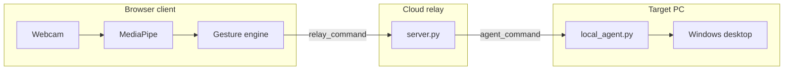

# Desktop AI Controller

Control your Windows PC with **hand gestures** and **voice commands**—no physical mouse required for many tasks. The system uses **MediaPipe** for real-time hand tracking and relays lightweight commands through a **cloud WebSocket server** to a **local agent** that executes actions on your desktop.


---

## Table of Contents

- [Overview](#overview)
- [Features](#features)
- [Architecture](#architecture)
- [How It Works](#how-it-works)
- [Project Structure](#project-structure)
- [Requirements](#requirements)
- [Quick Start (Cloud)](#quick-start-cloud)
- [Local Development](#local-development)
- [Deployment](#deployment)
- [Interaction Modes & Gestures](#interaction-modes--gestures)
- [Voice Commands (Jarvis)](#voice-commands-jarvis)
- [Legacy Local App](#legacy-local-app)
- [Configuration](#configuration)
- [Troubleshooting](#troubleshooting)
- [Performance](#performance)
- [License](#license)
- [Acknowledgments](#acknowledgments)

---

## Overview

**Desktop AI Controller** is a computer-vision-based desktop automation system. You use a webcam (on a phone or PC) to gesture in the air; the browser detects your hand and sends small command messages to a server; a Python agent on the **target PC** moves the cursor, clicks, changes slides, or runs voice-triggered actions.

### Why cloud + local agent?

| Design choice | Benefit |
|---------------|---------|
| **Hand tracking in the browser** | Video stays on your device—lower latency, more privacy |
| **Commands only over the network** | Tiny payloads (`MOUSE_MOVE`, clicks)—not full video upload |
| **Room-based pairing** | Same 6-character room ID links any browser to your PC |
| **Local agent on target PC** | Only the machine running `local_agent.py` is controlled |

### Two ways to run the project

| Mode | Entry point | Best for |
|------|-------------|----------|
| **Cloud (recommended)** | Web UI + `local_agent.py` | Control from any device; production deployment |
| **Legacy local** | `python mainGUI.py` | All-in-one PyQt app on one Windows PC |

---

## Features

- **Mouse mode** — Move cursor, left/right click, drag and drop
- **Presentation mode** — Previous/next slide via finger holds and palm/fist gestures
- **Media mode** — Play/pause, next/previous track via swipes and full palm
- **Jarvis mode** — Voice commands (browser speech-to-text → agent actions)
- **Smooth cursor** — Median filter and dead-zone smoothing in the browser
- **Mini / pop-out windows** — Keep tracking when the main tab is minimized
- **Background session** — Wake lock and hidden-tab frame loop for continuous control
- **Optional server-side CV** — Fallback path if client-side tracking is disabled

---

## Architecture

### High-level flow

```
┌─────────────┐     WebSocket      ┌──────────────┐     WebSocket      ┌─────────────────┐
│   Browser   │  relay_command     │ Cloud server │  agent_command     │  local_agent.py │
│  (React +   │ ─────────────────► │  server.py   │ ─────────────────► │   (PyAutoGUI)   │
│  MediaPipe) │                    │ Flask-SocketIO│                    │  Target Windows │
└─────────────┘                    └──────────────┘                    └─────────────────┘
       │                                    │
       └── Webcam stays local               └── Rooms pair frontend + agent
```

### Six processing layers

| Layer | Component | Role |
|-------|-----------|------|
| 1. Input | Webcam + microphone (browser) | Capture video/audio on the client device |
| 2. Gesture processing | MediaPipe WASM + `gestureEngine.ts` | 21 landmarks → classified actions |
| 3. Voice | Web Speech API + `voice_command` relay | Speech → text → agent |
| 4. Routing | Mode manager + Socket.IO rooms | Mouse / Presentation / Media / Jarvis |
| 5. Execution | `local_agent.py` | OS-level mouse, keyboard, apps |
| 6. Feedback | React canvas UI | Landmarks, mode, FPS, connection status |

### Mermaid diagram



---

## How It Works

1. Open the **web frontend** and enter the **server URL** and **room ID**.
2. Click **Connect** — the browser joins the room as `frontend` with **client-side tracking** enabled.
3. On the PC you want to control, run **`local_agent.py`** with the same server URL and room ID (joins as `agent`).
4. Click **Start Camera Stream** — MediaPipe runs in the browser at ~30 FPS.
5. Each frame: landmarks → `processGestures()` → `relay_command` → server → `agent_command` → PyAutoGUI / Win32 cursor.
6. After ~4 seconds without hand commands, the agent **releases** the cursor so your normal mouse works again.

---

## Project Structure

```
Desktop_AI_Controller/
├── frontend/                 # React + Vite web app
│   └── src/
│       ├── App.tsx           # Main UI, Socket.IO, camera loop
│       ├── handTracker.ts    # MediaPipe WASM loader + canvas draw
│       ├── gestureEngine.ts  # Finger rules, modes, screen mapping
│       ├── smoothPointer.ts  # Cursor stabilization
│       ├── backgroundSession.ts
│       ├── CompanionApp.tsx  # Mini pop-out window
│       └── companionWindow.ts
├── server.py                 # Flask-SocketIO cloud relay
├── local_agent.py            # Desktop executor (run on target PC)
├── HandTrackingModule.py     # MediaPipe helpers (server fallback + legacy)
├── mainGUI.py                # Legacy PyQt5 all-in-one app
├── bridge.py                 # Optional API to start/stop mainGUI
├── utils.py                  # Jarvis, speech-to-text, sounds (legacy)
├── config.py                 # Screen regions, volume (legacy)
├── requirements.txt          # Server / Docker dependencies
├── agent_requirements.txt    # Local agent dependencies
├── Dockerfile                # Render deployment
├── SERVER_SETUP.md           # Short deploy checklist
└── README.md                 # This file
```

---

## Requirements

### Cloud path

| Component | Requirement |
|-----------|-------------|
| **Target PC** | Windows 10/11, Python 3.10+ |
| **Browser** | Chrome or Edge (Chromium)—for MediaPipe WASM and Web Speech API |
| **Webcam** | Any standard webcam (720p recommended) |
| **Network** | Internet access to cloud server (Render or self-hosted) |
| **Optional GPU** | Speeds up browser MediaPipe (falls back to CPU) |

### Legacy path

| Component | Requirement |
|-----------|-------------|
| **OS** | Windows |
| **Python** | 3.8+ with PyQt5, OpenCV, MediaPipe, PyAudio (see `requirements.txt` + GUI deps) |
| **Hardware** | Webcam + microphone |

---